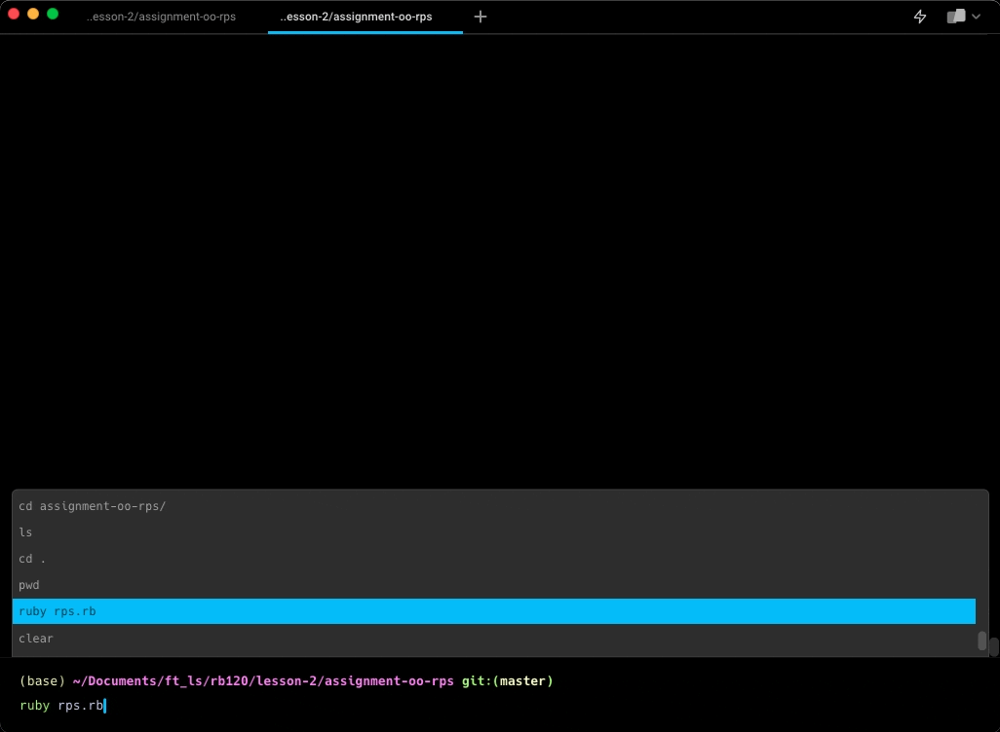

# Design Decisions #
---


# Table of Contents
1. [Move](#move-repeat)
2. [Player](#player-bust_in_silhouette)
3. [Human](#human-woman)
4. [Computer](#computer-desktop_computer)
5. [RPSGame](#rpsgame-joystick)

---
### Classes

---

#### Move :repeat:
- noun
- no interface exposure
- defines valid moves and key/value pairs with move and corresponding defeatable opponent moves
- behaviors:
  - checks if input is valid
  - defines a `win?` method to check winning moves
  - overrides `to_s` to output the value that was passed in (move)

#### Player :bust_in_silhouette:
- noun
- parent/super class to Human and Computer
- exposes the move and player name to the public interface
- behaviors:
  - instantiates an object with a call to `set_name` which is handled differently by Human and Computer objects
  - initializes a running score for the calling player to 0
  - initializes an empty array to track moves history
  - defines a `log_move` that pushes the current move to the moves history array
  - defines a `display_log` to check the Human's most common move choice and a tally
  - overrides a print to expose moves history to the public interface

#### Human :woman:
- noun
- inherits from Player
- behaviors:
  - asks user for name until they give one

  - asks user for a move until they give one that matches the valid moved predetermined in the `Move` class
  - logs the current move the human just made to the moves history
  - reassigns the class variable `@@previous_move` to the latest move, this gets used by computer personalities

    ```diff
    + added improve functionality to reject empty strings
    + added a method to handle short hand user input for better user experience
    + class method to handle the reset of user input in the shorthand method
    ```


#### Computer :desktop_computer:
- noun
- inherits from Player
- behaviors:
  - chooses a computer name at random
  - chooses a computer move using methods from the `Confrontable` module
    - [different robots have different preferences](bonus_features.md#computer-personalities)
    - all robots use weighted ranges and randomized samples-- a number between 0 and 100 is chosen at random and checked against weighted ranges. If a robot is more likely to choose `rock`, that move's range is wider in the weighted ranges.
    - `Mr. Roboto` is the only robot that tries to play on the offensive, he uses the `attack` method from the `Confrontable` module to sample (most of the time) from moves he can actually beat. This is where the class variable `@@previous_move` comes in handy-- since we only log the Human moves, it's useful that the class method can be available to all instance and can be overriden. Although, this might still be a vulnerability if the program grew more complex, and certainly if we wanted to also log robot moves.

#### RPSGame :joystick:
- noun
- exposes :human and :computer ivars to the public interface so we can display moves
- behaviors:
  - instantiates Human and Computer objects
  - displays pre-game functionality such as rules and the opponents' secret
  - enters a game cycle
      - enters a round mini-cycle where human and robot alternate making choices
      - displays current round's win
      - displays ultimate winner
      - breaks if the user doesn't want to play again
    - end of round functionality
      - displays game stats and goodbye message
    ```diff
    + added a constant to check ultimate winner
    + class variable used to break out of the game loop (see specifications on handling of new round)
    ```

### Modules
1. ~~Askable~~
    - ~~`prompt`~~
    ```diff
    - moved this single method to Orchestratable module
    ```
2. Confrontable

    Holds all methods related to the opponent or to game strategy

    - `display_opponent_secret`
    - `display_opponent_face`
    - `attack`
    - `probability_based_sample`
    - `assign_personality`

3. Orchestratable

    Holds methods related to the orchestration of the game that were beyond the basic handling of the game loop.

    - `prompt`
    - `system_functionality`
    - `display_rules`
    - `display_move`
    - `display_winner`
    - `increment_score`
    - `display_scoreboard`
    - `display_ultimate_winner`
    - `game_round`
    - `end_of_round`

    ```diff
    + prompt method was added
    + new method for handling a new round: asks for new opponent preference, makes use of the class variable to kill game from inside the external method (external to the loop).
    ```

4. Prettifyable

    Holds all the methods related to user interface/user experience.
    - `flashing_display`
    - `slow_display`
